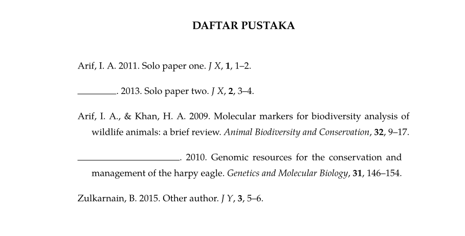

# Format Sitasi & Daftar Pustaka TA FPIK Unsoed

**Initial Contributor**: [Talitha Nada Aristawati](mailto:talitha.aristawati@mhs.unsoed.ac.id).

Uploaded here for documentation

## Ringkasan

Gaya atribusi format TA FPIK 2018 (dan 2026) merupakan adaptasi dari gaya atribusi American Psychological Association (APA Style).

Repositori ini adalah repo untuk menyimpan kode sumber dari csl format TA FPIK dan templat bahasa markup lainnya.
Repo ini bukan merupakan repo resmi dari FPIK UNSOED.

### Yang tidak dapat dilakukan oleh CSL

Di Pedoman TA FPIK (2018) dicantumkan bahwa:

> Penyusunan penulis lebih dari satu dengan nama yang sama, 
> maka daftar pustaka berikutnya tidak menuliskan nama penulis lagi 
> dan diganti dengan garis(underline)

Hal ini tidak bisa dilakukan **secara rapih** oleh CSL.
Apabila CSL menerapkan ini, maka panjang tiap garis akan sama untuk tiap barang daftar pustaka, sehingga tidak sesuai pemformatan.
Sekiranya tanpa garis, daftar pustaka tetap dapat diterima.

Namun, penerapan ini dapat dilakukan melalui templat typst,
Sebagaimana ditunjukkan oleh gambar berikut.

## 🎮 Untuk Pengguna Akhir

Pilih versi paling terbaru dari templat:

  1. Pergi ke [Templat Sitasi dan Dafpus TA FPIK terbaru di sini](https://github.com/willdone-mt/unsoed-fpik-format/releases/latest)
  2. Klik *drop down* `Assets` (Gulir ke bawah apabila tidak ditemukan)

> [!NOTE]
>
> Versi terbaru akan ditampilkan otomatis apabila sudah ada penyesuaian setelah 
> pengumuman/penerbitan Pedoman TA FPIK terbaru (yaitu 2026)

Apabila membutuhkan tautannya, maka:

  3. Klik kanan pada teks bertautan dengan akhiran `.xml` atau `.csl`
  4. Salin tautan tersebut

Apabila membutuhkan berkasnya, maka:

  3.  Klik (kiri) pada teks bertautan tersebut
  4.  Berkas CSL akan terunduh

Lalu, ikuti salah satu bagian di bawah ini untuk tutorial instalasi templat

Apabila instalasi templat tidak berhasil, gunakan versi [alpha dari templat ini disini](https://github.com/willdone-mt/unsoed-fpik-format/releases/tag/v2018.1.1-alpha1)

### 💤 Zotero

[Instalasi pada Zotero](docs/tutorial/zotero.md)

### ✨ Mendeley

- [Instalasi pada Mendeley **Desktop** v1.19.8](docs/tutorial/mendeley_desktop.md)
- [Instalasi pada Mendeley **Reference Manager**](docs/tutorial/mendeley_referencemanager.md)
- [Instalasi pada Mendeley **Cite** (Add-in untuk MS Word Online)](docs/tutorial/mendeley_cite.md)

### Perangkat Lunak Pengelola Referensi Lainnya

### Pengajuan Masalah

Pengajuan masalah bisa menggunakan Github Issue

## Tersedia Template TA FPIK!

- [X] Typst
- [ ] Latex
- [ ] Docx
- [ ] Google Docs

## 🐍 Untuk Kontributor (Pengodean)

Detail bisa dilihat di [dokumen ini](CONTRIBUTING.md)